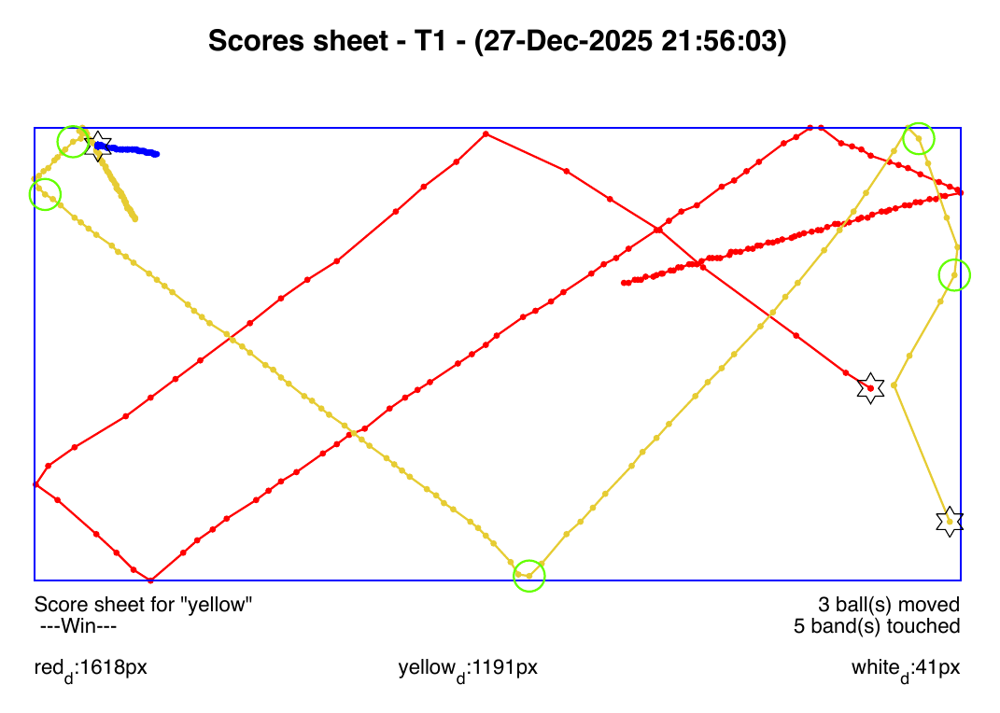
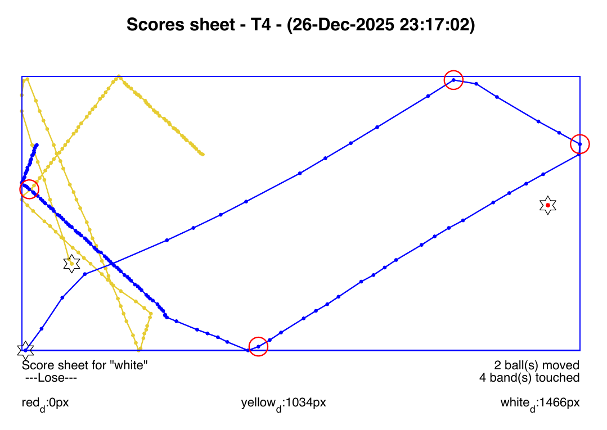

# 🎱 Billiard Shot Analyzer: LabVIEW × C × MATLAB

An automated pipeline that reads a video sequence of a **three-cushion carom billiards** shot frame by frame, detects the three balls with a C image-processing program, rebuilds their trajectories, and judges in MATLAB whether the shot scores. Each run produces a graphical **score sheet (PDF)** and a machine-readable **summary**.

> Third-semester Programming course project (Fall 2025), built by a team of four on macOS with **LabVIEW**, **C** (Xcode/clang) and **MATLAB**.

<p align="center">
  
  
</p>
<p align="center"><sub>Generated score sheets. Left: T1, a <b>win</b> (yellow cue ball, 3 balls moved, 5 cushions). Right: T4, a <b>loss</b> (white cue ball never reaches the red one).<br>
Stars = starting positions · circles = cushion contacts (green = win, red = loss) · white ball drawn in blue for contrast.</sub></p>

---

## Highlights

- **Three languages, one pipeline.** LabVIEW orchestrates the run and the UI, a native C executable does the pixel work, and MATLAB does the analysis and reporting. They talk through command-line arguments, binary files and generated scripts.
- **Ball detection from raw pixels in C.** The program bit-unpacks RGB values and runs a sliding-window colour-match search, with no image-processing libraries.
- **Defensive input validation.** The C program checks 11 distinct error conditions, each with its own exit code and a message on `stderr` that LabVIEW reads and shows to the user.
- **Signal cleaning before analysis.** Missing detections (`NaN`) are interpolated and tracking glitches are removed with a moving-median outlier filter.
- **Vectorised game logic.** The order in which the balls start moving is found with a single `sortrows` on a small matrix, with no long `if/elseif` chains.
- **Code generation.** LabVIEW writes a complete, parameterised MATLAB script (`AnalyseTx.m`) for each sequence, so every analysis can be reproduced on its own.

---

## How it works

```
 ┌─────────────────────────────── LabVIEW (Billard2025.vi) ───────────────────────────────┐
 │                                                                                         │
 │  sequence folder ──► first frame ──► loop-proj.vi ──► table cushion bounds (dark blue)   │
 │        │                                                                                │
 │        ▼  for each .png frame                                                           │
 │   frame ──► pixmap.bin ──► call-C-proj.vi ──► ./Pix2Pos <29 args> ──► pos.txt ──┐        │
 │                                                                                │        │
 │                    trajectories Xr,Yr / Xy,Yy / Xw,Yw  ◄───────────────────────┘        │
 │                                  │                                                      │
 │                                  ▼                                                      │
 │        script-Matlab-proj.vi ──► AnalyseTx.m  (data + UI settings baked in)             │
 │                                  │                                                      │
 │        MP_LaunchMatlabScript4.vi ▼                                                      │
 └──────────────────────────── MATLAB ──► ScoreSheetTx.pdf + SummaryTx.txt ────────────────┘
```

### 1. LabVIEW: orchestration and UI
| VI | Role |
|---|---|
| `Billard2025.vi` | **Main VI.** Front panel, reads the sequence folder, chains the sub-VIs, reports errors |
| `loop-proj.vi` | Finds the table's cushion rectangle by scanning pixel rows and columns for the dark-blue border colour. It still works when the border line is not perfectly continuous |
| `call-C-proj.vi` | Runs `Pix2Pos` with the table bounds, colour ranges and ball size, and collects `pos.txt` and `stderr` |
| `script-Matlab-proj.vi` | Generates `AnalyseTx.m` with the trajectories and the user's plot settings |
| `MP_LaunchMatlabScript4.vi` | Runs the generated MATLAB script |

The front panel controls the trajectory line style, the win and loss marker colours, the ball size, the sequence path, and two switches: *generate script* and *auto-open the PDF*. LabVIEW skips files that are not `.png`, flags corrupt `.png` files, and stops the data flow if the executable can't be run.

### 2. C: `Pix2Pos.c`, ball detection
**Input:** `pixmap.bin` plus 29 command-line arguments:

```
./Pix2Pos  ymin ymax xmin xmax                     # inner table rectangle
           rR- rR+ gR- gR+ bR- bR+                 # red ball RGB range
           rY- rY+ gY- gY+ bY- bY+                 # yellow ball RGB range
           rW- rW+ gW- gW+ bW- bW+                 # white ball RGB range
           rB- rB+ gB- gB+ bB- bB+                 # table (blue) RGB range
           ballDiameter                            # in pixels, 10..15
```

`pixmap.bin` layout: `uint32 width`, `uint32 height`, then `width × height` pixels packed as `uint32 0x00RRGGBB`.

**Algorithm:**
1. Parse and validate every argument, including bounds, RGB values in `[0, 255]`, and a ball diameter that is numeric and in `[10, 15]`.
2. Read the image header, check the dimensions (`100..1000` px), and load all pixels into memory allocated with `malloc`. The program then checks that the file holds exactly `width × height` pixels, no fewer and no more.
3. For each ball colour, slide a `D × D` window (D = ball diameter) over the inner table area. A window's **score** is the number of its pixels that fall inside that colour's RGB range.
4. The window with the best score gives the ball's position. If the best score is below the threshold of 15 pixels, the ball counts as *not found* and is written as `-1, -1, 0`. This is a warning, so the run continues.
5. Write `pos.txt` and free the memory.

```
Red: 508, 201, 125
Yellow: 193, 160, 78
White: 207, 118, 118
```

**Error codes** (each one prints `ERREUR: …` to `stderr` and the program exits with that code):

| # | Name | Meaning |
|---|---|---|
| 1 | `errLigneCommande` | Wrong number of arguments |
| 2 | `errOuverture` | Can't open `pixmap.bin` or create `pos.txt` |
| 3 | `errPixelsManquants` | Header (width/height) missing |
| 4 | `errRectInvalide` | Image size out of range, or invalid inner rectangle |
| 5 | `errRectNegatif` | Negative coordinates |
| 6 | `errColorRange` | RGB value outside `[0, 255]` |
| 7 | `errBallDiam` | Ball diameter outside `[10, 15]` |
| 8 | `errMalloc` | Memory allocation failed |
| 9 | `errTropPetite` | Fewer pixels than `width × height` |
| 10 | `errTropGrande` | More pixels than `width × height` |
| 11 | `errBallLettre` | Ball diameter contains a non-digit character |

### 3. MATLAB: `AnalyseTx.m`, trajectory analysis and scoring
1. **Clean the data.**
   - `InterpolateNan` fills missing detections using `interp1(..., 'next')`, padding the ends of the series so the first and last values are handled too.
   - `RemoveOutlier` finds tracking spikes with `isoutlier(..., 'movmedian', 10)` and replaces each one with the previous value.
2. **Geometry.** `GetFrame` builds the table frame from the global min/max of all positions. `GetBallPathLength` adds up the Euclidean segment lengths to get the distance each ball travelled.
3. **Movement order.** `GetFirstMoveIdx` returns the first frame where a ball is more than 9 px from its starting point. `GetBallMoveOrder` packs `[firstMoveIdx, firstSegmentLength, ballId]` into a matrix and calls `sortrows(M, [1 -2])`: balls are ordered by when they start moving, and ties are broken by the longer first step. Balls that never move get an index of `len+1` and are filtered out.
4. **Cushion contacts.** `GetTouchIdx` finds the frames where the cue ball is within 9 px of each cushion and keeps only the first frame of each run of consecutive frames. Each cushion is handled separately, so two different cushions hit in back-to-back frames still count as two contacts. The results are then merged and sorted.
5. **Scoring (three-cushion rule).** A shot **wins** if all three balls moved **and** the cue ball touched at least **3 cushions** between hitting the second ball and hitting the third. Any other shot loses.
6. **Output.**
   - `ScoreSheetTx.pdf`: the trajectories, the table frame, the starting positions, the cushion hits, the verdict, the number of balls moved and cushions touched, and the distance each ball travelled.
   - `SummaryTx.txt`: a one-line summary for automatic grading.

```
f:y; s:w; n:3; b:5; rb:1618; yb:1191; wb:41;
│    │    │    │    └── distance travelled per ball (px): red / yellow / white
│    │    │    └─────── cushions (bands) touched
│    │    └──────────── number of balls moved
│    └───────────────── shot result: w = win, l = lose
└────────────────────── first ball to move (cue ball): r / y / w
```

---

## Results

| Seq. | Cue ball | Result | Balls moved | Cushions | Red (px) | Yellow (px) | White (px) |
|---|---|---|---|---|---|---|---|
| T1 | yellow | ✅ Win | 3 | 5 | 1618 | 1191 | 41 |
| T3 | white | ✅ Win | 3 | 7 | 757 | 32 | 1784 |
| T4 | white | ❌ Lose | 2 | 4 | 0 | 1034 | 1466 |
| T5 | white | ❌ Lose | 2 | 5 | 252 | 1 | 1187 |
| T6 | yellow | ❌ Lose | 2 | 6 | 14 | 1494 | 1301 |
| T7 | white | ✅ Win | 3 | 6 | 20 | 2125 | 1878 |
| T9 | white | ✅ Win | 3 | 5 | 945 | 45 | 2027 |

Each sequence has its generated `AnalyseTx.m`, `ScoreSheetTx.pdf` and `SummaryTx.txt` in this repo.

---

## Repository layout

```
├── Billard2025.vi                 # LabVIEW main VI (UI + orchestration)
├── loop-proj.vi                   # sub-VI: detect table cushion bounds
├── call-C-proj.vi                 # sub-VI: run the C detector
├── script-Matlab-proj.vi          # sub-VI: generate the MATLAB script
├── MP_LaunchMatlabScript4.vi      # sub-VI: run MATLAB
├── Projet-Prog.lvproj             # LabVIEW project
├── Pix2Pos.c                      # C ball-detection program
├── Pix2Pos                        # compiled macOS binary
├── AnalyseT{1,3,4,5,6,7,9}.m      # generated MATLAB analyses, one per sequence
├── ScoreSheetT*.pdf               # graphical results
├── SummaryT*.txt                  # text results
├── pixmap.bin / pos.txt           # example C input/output (last processed frame)
├── docs/                          # README images
└── Documentation Projet Billiard 2025.pdf   # full project report (French)
```

> The input frame sequences (`.png`) came with the course and are not included here.

---

## Running it

**Requirements:** macOS, LabVIEW 2025, MATLAB (with `isoutlier`, R2017a+), and a C compiler.

```bash
# 1. Build the detector
clang -O2 -Wall -o Pix2Pos Pix2Pos.c

# 2. (optional) Run it on its own against the sample pixmap
./Pix2Pos <ymin> <ymax> <xmin> <xmax> <24 RGB bounds> <ballDiam>
cat pos.txt
```

3. Open `Projet-Prog.lvproj` in LabVIEW and run **`Billard2025.vi`**.
4. On the front panel, select a sequence folder of `.png` frames, set the ball size and plot style, and run. The score sheet PDF opens automatically if that option is on.

To re-run only the analysis, open any `AnalyseTx.m` in MATLAB and run it, since the trajectories are already embedded in the script.

> **macOS note:** if LabVIEW reports `error 126 – ./Pix2Pos Operation not permitted`, Gatekeeper is blocking the prebuilt binary. Recompile it with the command above, or run `xattr -d com.apple.quarantine Pix2Pos`.

---

## Known limitations and possible improvements

- **Event ordering near collisions.** In T1 and T3, the cue ball hits the last ball and *then* touches a cushion. Because `GetTouchIdx` keeps the first frame of each contact, a cushion hit a frame or two after a ball contact can be counted as happening before it. Placing ball-to-ball contacts at a finer time resolution would fix this.
- **Ties in move order.** When two balls start moving in the same frame and both first steps are 0 (as in T6), the tie-break has nothing to go on. It happens to give the right answer here, but a more robust rule would look further ahead in the trajectory.
- **Detection cost.** The sliding window is `O(W·H·D²)` per colour. Using a **summed-area table (integral image)** would bring it down to `O(W·H)` without changing the results.
- **Cushion count when fewer than 3 balls move.** Every contact is reported without filtering, because the specification didn't define this case. Reporting `N/A` would be clearer.

---

## Authors

**Makram Fadel** · Rafaela Rebeiz · Kevin Jandri · Jamil Mansour

The full design document (in French), with the data-flow description, error handling and algorithm notes, is in [`Documentation Projet Billiard 2025.pdf`](Documentation%20Projet%20Billiard%202025.pdf).
